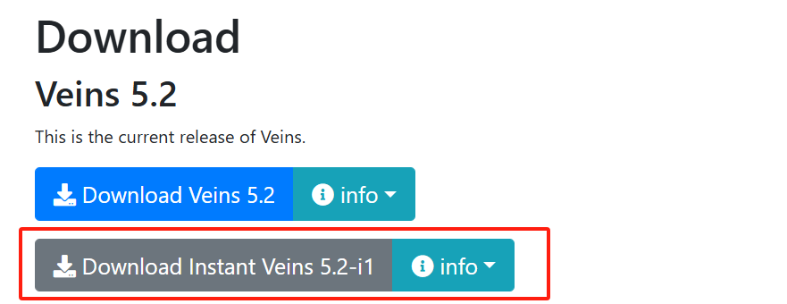
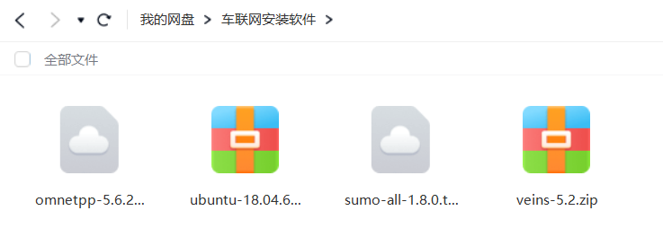
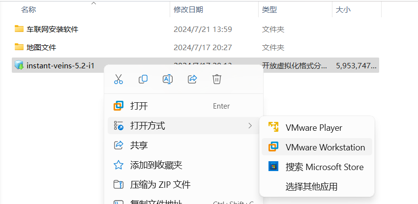
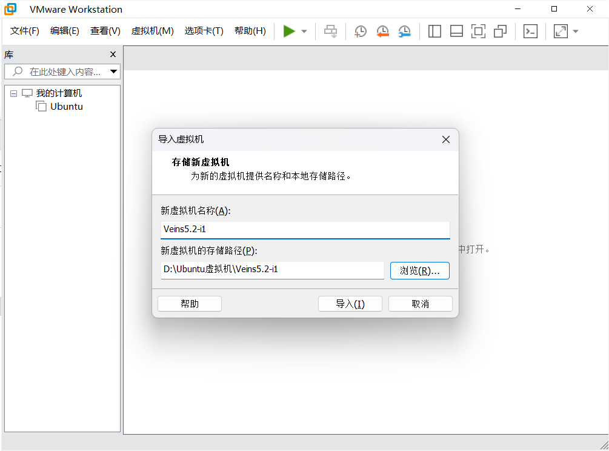
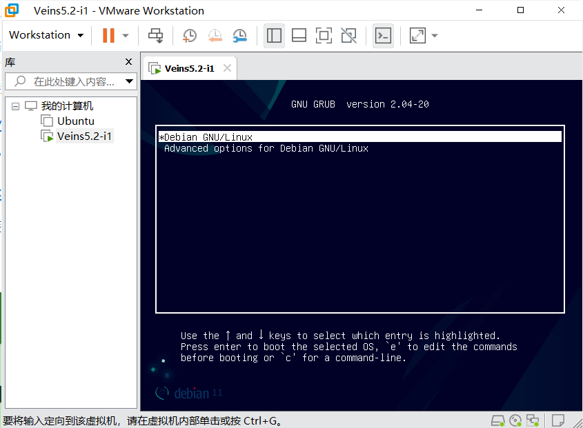
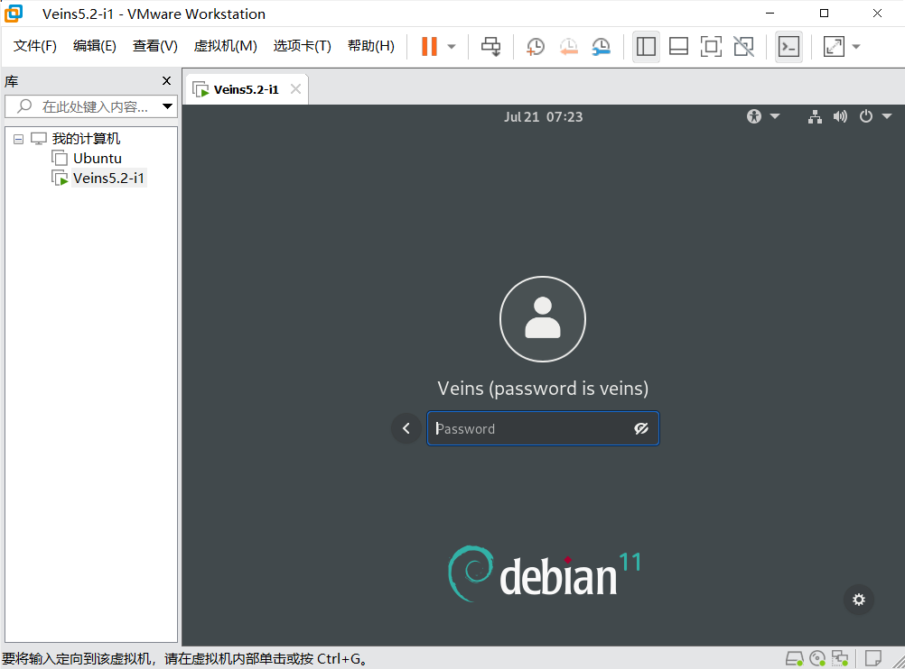
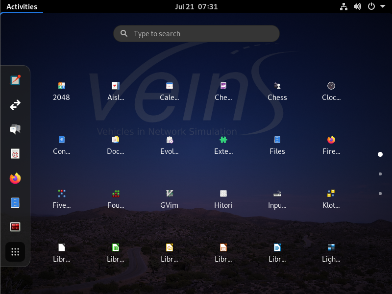

# Veins 5.2-i1简易版安装教程
1. 首先先安装`VM ware`，在CSDN上有很多教程。安装好`VM ware`之后，去Veins官网[https://veins.car2x.org/download/](https://veins.car2x.org/download/)下载Veins 5.2-i1的文件，如图(点击下载框选中的文件)：

在官网下载速度一般比较慢，可以到这个网盘地址中下载所需要的文件：
    > 链接：https://pan.baidu.com/s/1E4OFcs62SuenYz3MmShZQg?pwd=1234 提取码：1234

1. 在下载好这个文件之后，在文件夹中，右键点击文件，以`VM ware`方式打开文件，如图：

1. 打开后的文件，名称和存储路径自己选择就好，最好安装在D盘中：

1. 选择上面的那个Debian通用操作系统，按Enter进入：

1. 在进入后，输入的密码是：**veins**

1.  进入系统之后，所有的软件都在左上角那个`Activities`中:

这样就已经安装完成了。
